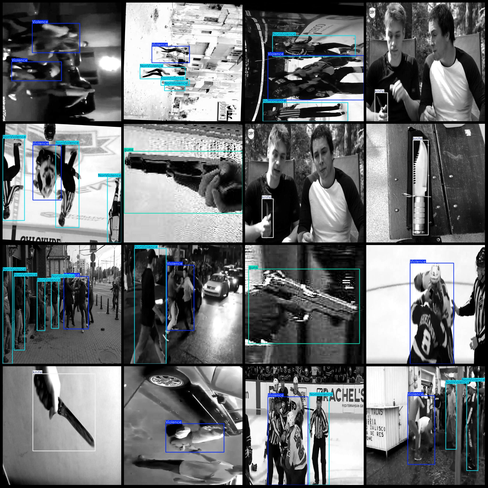
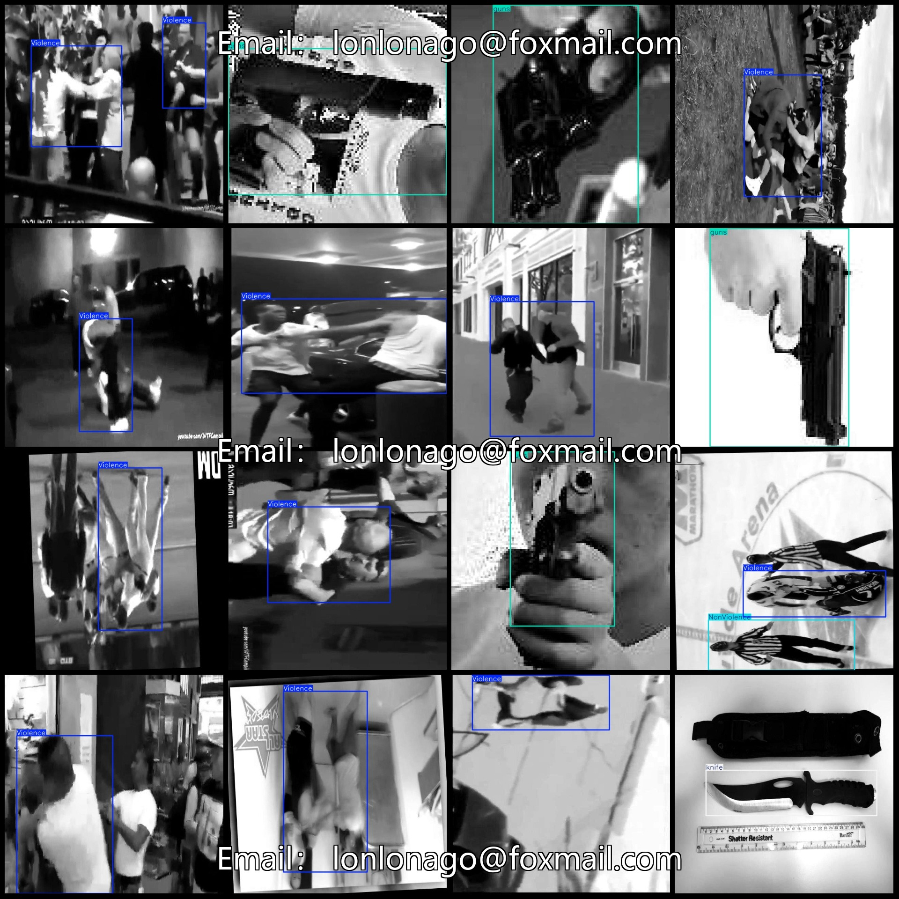

# Campus Violence Public Safety Area Violent and Dangerous Behavior Fighting with Knives Dataset (VOC+YOLO)

## Dataset Format: Pascal VOC format + YOLO format (txt files without split paths, only containing jpg images along with corresponding VOC format xml files and YOLO format txt files)

### Image Count (Number of jpg Files): 12447

### Annotation Count (Number of xml Files): 12447

### Annotation Count (Number of txt Files): 12447

### Number of Annotation Categories: 4

### Annotation Category Names (Note that the order of categories in the yolo format does not match this, but is based on the labels folder's classes.txt): ["NonViolence", "Violence", "guns", "knife"]

Each category has the following number of bounding boxes:
- NonViolence: 4924 boxes
- Violence: 5609 boxes
- guns: 3162 boxes
- knife: 3339 boxes
Total bounding boxes: 17034

Image resolution: 640x640

Using annotation tool: labelImg
Annotation rules: drawing bounding boxes for each category

Important Notes: None

Special Notice: This dataset does not guarantee the accuracy of trained models or weight files.

Image Preview:

## Images

Here is a pay link on Stripe ( https://buy.stripe.com/3cs8yP7sY87d0vu9AB ). Please contact me lonlonago@foxmail.com after funding $89, and I will send you a complete data files , thank you!

